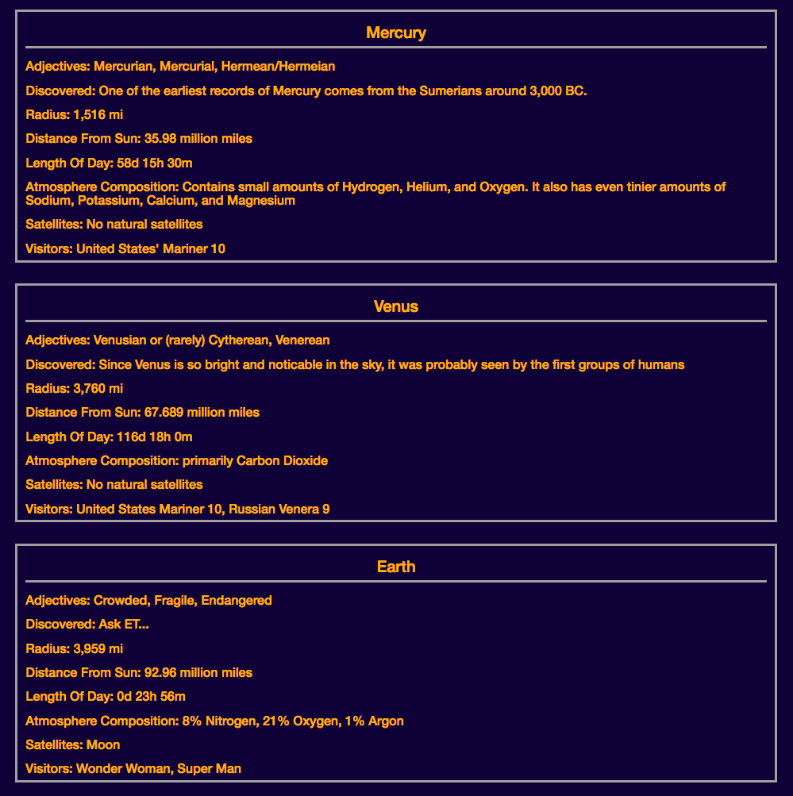

# Solar System

> Nashville Software School, Full-Stack Dev Bootcamp, Front-End Independent Exercise
> 

## Requirements

## Requirements

You'll be creating a web page that will display important scientific data about all eight planets in our solar system. The information about each planet will be separate modules.

1. Each module will export a single function named `outputTo` that will accept a single argument. That argument's value will be the DOM element reference into which it will insert information about a planet.

    
2. Each module should output the following information.
    1. Name
    2. Year discovered
    3. Mass
    4. Size
    5. Distance from Sun
    6. Atmosphere composition
    7. Satellites
    8. Name of any probes/orbiters/explorers that have visited or landed on that planet
3. Create a main module that uses `require` to include each planet's module as a dependency and then subsequently calls the `outputTo()` method for each one, in the right order.



	
### How to run (Node must be installed on your machine):
```
git clone https://github.com/lady-ace/solar-system
cd solar-system
npm install http-server -g
http-server -p 8080
```

This will show in your browser at:
`http://localhost:8080`

### Contributors:
[Jessica Brawner](https://github.com/lady-ace)